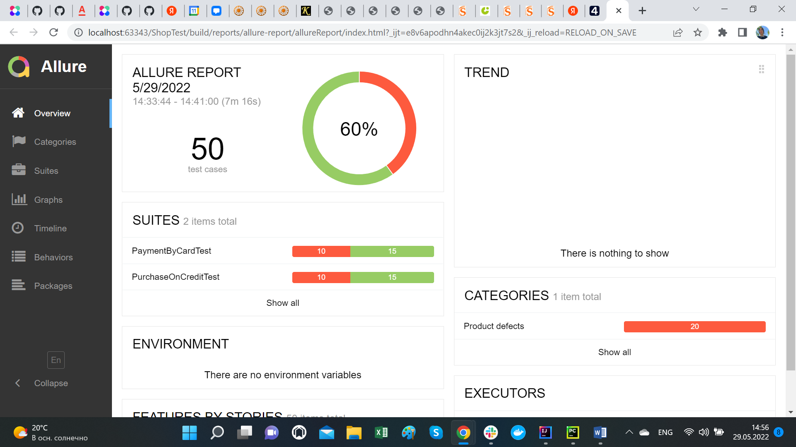

#### 1. Для тестирования формы использовались валидные и разные невалидные данные, большинство полей справлялось с разными видами невалидных данных. Но поле имени владельца оказалось без каких-либо ограничений, оно не оставляло никаких сообщений об ошибках, и форма принимала его.
#### Приложение без ошибок работает с платежной системой и базой данных.

#### 2. Всего автоматизировано 50 тест-кейсов, 20 из них оказались упавшими.
#### 3. 60% успешных / 40% не успешных
#### 4. Рекомендую: 
* проработать поле для ввода имени владельца (ввести граничные значения, поставить ограничение на ввод нестроковых значений)
* подкорректировать внешний вид пользовательского интерфейса
* добавить в этот и добавлять в следующие проекты data-test-id селекторы

